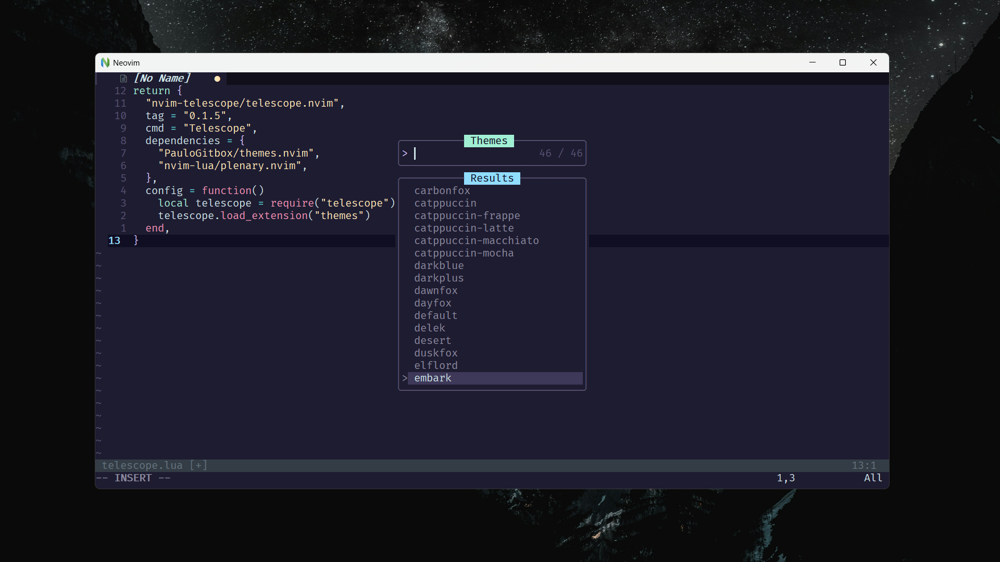

# ${\textsf{\color{#00A6ED}Themes}}$🎨 menu for Neovim (using Telescope plugin) 

An extension for Telescope plugin to switch colorschemes. It will read all your installed themes (in addition to Nvim builtin themes)



---
### Prerequisite  [Telescope🔭](https://github.com/nvim-telescope/telescope.nvim) (plugin for neovim)
---

## Installation 🛠️

Using [packer.nvim](https://github.com/wbthomason/packer.nvim) or [lazy.nvim](https://github.com/folke/lazy.nvim) plugin managers

 <details><summary><h3> 🔻 ${\textsf{\color{lightgreen}Add this line to your init.lua :}}$ </summary>
  <div align="left">

  ```
require("current-theme")
  ```

</details>

 <details><summary><h3> 🔻 ${\textsf{\color{lightskyblue}As a plugin, example with keybind (using lazy)}}$ </summary>
  <div align="left">

  ```lua
return {
	"nvim-telescope/telescope.nvim",
	tag = "0.1.5",
	cmd = "Telescope",
	dependencies = {
		"PauloGitbox/themes.nvim",
		"nvim-lua/plenary.nvim",
	},
	config = function()
		local telescope = require("telescope")
		telescope.load_extension("themes")
	end,
},

vim.keymap.set("n", "<leader>th", ":Telescope themes<CR>", {noremap = true, silent = true, desc = "Theme Switcher"})

```

  </div>
</details>

---

### Usage ⚙️

```lua
:Telescope themes
```

Keybind to  • `<leader>`th •  for quick access
```lua
vim.keymap.set("n", "<leader>th", ":Telescope themes<CR>", {noremap = true, silent = true, desc = "Theme Switcher"})
```

---

### Important⚠️
You need to add require **`require("current-theme")`** at the end of your ${\textsf{\color{lightgreen}init.lua}}$ so the theme you have selected loads on every startup.
As the extension is writing the colorscheme command in your config, and neovim configs are very indvidual and unique, it is hard to predict which part to manipulate, so the ${{\textsf{\color{gold}extension creates a file named {\textsf{\color{#F49EC4}current-theme.lua{\textsf{\color{gold} will be generated in root of /lua directory}}}}}}}$, it contains the command responsible ${\textsf{\color{#00A64F}for saving the latest theme}}$ and it's overwritten by the extension on every new selection.<br>
vim.o.termguicolors = true

---

### Credits
Neovim's plugin Telescope🔭: [nvim-telescope/telescope.nvim](https://github.com/nvim-telescope/telescope.nvim)<br>
Lazy💤 plugin manager [folke/lazy.nvim](https://github.com/folke/lazy.nvim)<br>
Screenshot colorscheme [embark-theme/vim](https://github.com/embark-theme/vim)<br>
Original made by [/andrew-george/](https://github.com/andrew-george/telescope-themes)<br>
- It is inspired by [NvChad's](https://github.com/NvChad/NvChad) theme switcher, but made to work with most custom configurations.
